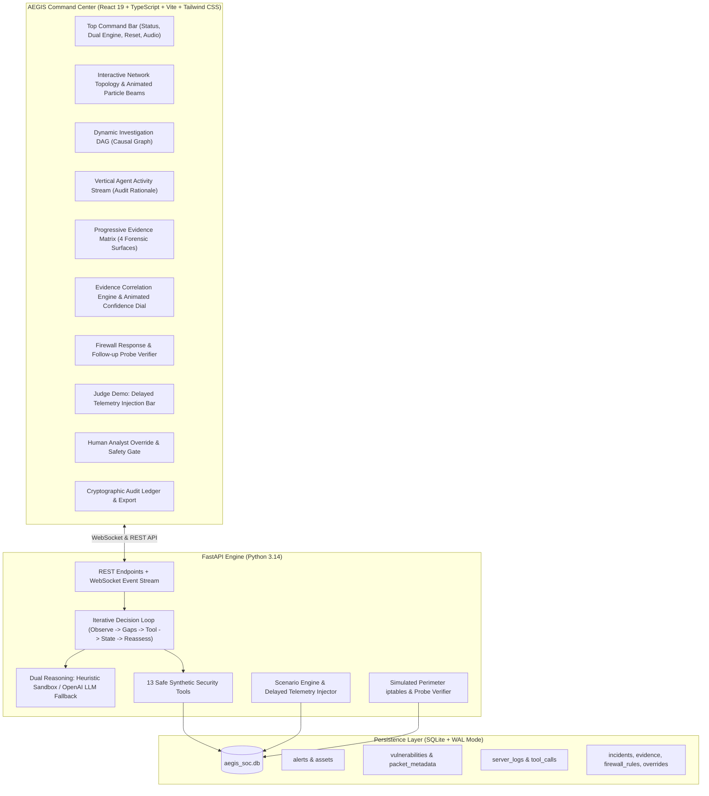
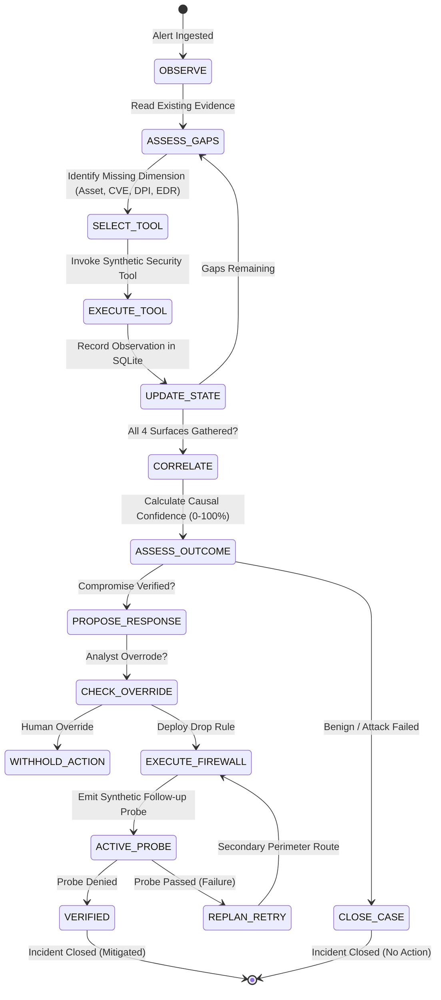

# AEGIS // AUTONOMOUS SOC
> **"Investigate. Correlate. Respond. Verify."**  
> *Production-Grade Autonomous Cybersecurity Investigation & Response Platform for IIT Bhubaneswar Problem Statement 9.*

---

## 1. Executive Summary & Product Concept

**AEGIS // AUTONOMOUS SOC** is a state-of-the-art autonomous cybersecurity command-center system designed to solve alert fatigue and automate the complex investigation, multi-source evidence correlation, closed-loop response, and dynamic reassessment lifecycle in a Security Operations Center (SOC).

Traditional SOC dashboards are static alert displays or simple notification panels. **AEGIS is an active autonomous agentic system**:
1. **Investigates**: When an intrusion alert arrives (e.g. Suricata NIDS), the agent analyzes knowledge gaps and calls discrete security tools (`get_asset`, `get_vulnerabilities`, `get_packet_metadata`, `get_server_logs`).
2. **Correlates**: Evaluates 4 distinct forensic evidence surfaces (Asset exposure, CVE applicability, Deep Packet Payload, Host EDR execution).
3. **Responds**: If the attack is verified, proposes and deploys a simulated perimeter firewall rule (`DROP` from attacker IP).
4. **Verifies (Closed-Loop)**: Emits a simulated synthetic probe packet to actively confirm whether the firewall successfully rejected the traffic.
5. **Reassesses**: Dynamically reopens cases when late-arriving telemetry changes environmental assumptions (IIT Bhubaneswar Judge Demo).
6. **Maintains Human Oversight**: Analysts can inspect, approve, override, or request reassessment at any point.

---

## 2. IIT Bhubaneswar Requirement Mapping

| IIT Bhubaneswar Criteria | AEGIS Implementation | Architectural Evidence |
| :--- | :--- | :--- |
| **Goal-Driven Execution** | Agent operates toward the explicit goal of verifying whether an alert resulted in true host compromise. | `AgentOrchestrator.run_full_autonomous_loop()` |
| **Meaningful Tool Interaction** | 13 discrete simulated security tools querying distinct simulated systems (Asset CMDB, CVE catalog, DPI packets, Host EDR, Firewall). | `backend/tools/synthetic_tools.py` |
| **Persistent Task State** | Multi-table SQLite database tracks every iteration, gap assessment, tool call, observation, and state change across reloads. | `backend/database/models.py` |
| **Action + Feedback Loop** | Automated deployment of perimeter drop rule followed immediately by observation of execution result. | `AgentOrchestrator.execute_response_and_verify()` |
| **Replanning on Failure** | When firewall deployment encounters edge timeout or verification probe fails (Scenario 05), the agent diagnoses failure and retries secondary route. | `test_scenario_05_response_failure_and_replanning` |
| **Changed-Condition Reassessment** | "INJECT DELAYED EVIDENCE" trigger simulates late-arriving EDR telemetry. Agent detects new evidence, reopens incident, flips verdict, and blocks. | `test_scenario_04_delayed_evidence_reassessment` |
| **Response Verification** | Follow-up synthetic probe checks whether malicious traffic is actually denied; never assumes success without confirmation. | `SyntheticSecurityTools.verify_block()` |
| **Human-in-the-Loop Override** | Analyst gate with `APPROVE`, `OVERRIDE`, and `REASSESS` options. Agent withholds action when commanded. | `HumanOverrideModal.tsx` & `/api/human-override` |

---

## 3. System Architecture



---

## 4. Agentic Decision Loop

Unlike hardcoded scripts or static dashboards, AEGIS implements an iterative OODA loop:



---

## 5. The 13 Synthetic Security Tools

All tools operate strictly on local SQLite synthetic data with zero interaction with the host network:

1. `get_alert(alert_id)`: Fetches NIDS signature, rule ID, source, target, and payload.
2. `get_asset(ip)`: Queries CMDB for OS, running service, version, open ports, criticality.
3. `get_vulnerabilities(service, version)`: Performs semantic version range queries against CVE catalog.
4. `get_packet_metadata(alert_id)`: Layer-7 deep packet inspection for weaponized exploit signatures.
5. `get_server_logs(asset_ip, timeframe)`: Ingests host auditd/EDR process execution logs and HTTP statuses.
6. `search_related_logs(query, asset_ip)`: Forensic regex/text search over host events.
7. `get_recent_activity(asset_ip)`: Real-time telemetry feed of target asset.
8. `get_firewall_status()`: Inspects simulated perimeter iptables rules.
9. `block_ip(ip, simulate_failure)`: Injects simulated drop rule (supports edge timeout failure injection).
10. `unblock_ip(ip)`: Removes IP from simulated perimeter table.
11. `verify_block(ip)`: Emits synthetic follow-up connection to verify drop enforcement.
12. `get_investigation_state(incident_id)`: Retrieves historical state machine iterations.
13. `get_human_override(incident_id)`: Checks analyst policy directives.

---

## 6. The 6 Demonstrable Scenarios

1. **01 — SUCCESSFUL EXPLOIT**: Unpatched Struts 2.3 -> CVE-2017-5638 match -> Weaponized OGNL packet -> Spawned shell -> 94% Confidence -> Perimeter Block -> Active Probe Verified.
2. **02 — FAILED EXPLOIT**: Exploit traffic detected -> Target is patched (Struts 2.5.26) -> Server returns HTTP 403 Forbidden -> Attack Failed -> Zero block deployed.
3. **03 — FALSE POSITIVE**: Benchmark probe triggers NIDS -> Asset is static Nginx -> Benign packet -> Zero CVE match -> Case closed as benign.
4. **04 — DELAYED EVIDENCE (JUDGE DEMO)**: Telemetry starts ambiguous -> Judge clicks "INJECT DELAYED EVIDENCE" -> Delayed shell telemetry appears -> Agent reopens incident -> Reassesses verdict to ATTACK VERIFIED -> Deploys block -> Verifies.
5. **05 — RESPONSE FAILURE & RETRY**: Firewall deployment encounters simulated edge timeout -> Verification probe fails -> Agent flags failure -> Replans with secondary perimeter route -> Retries -> Verified.
6. **06 — HUMAN OVERRIDE**: High-confidence exploit -> Agent recommends block -> Security Analyst intervenes via override modal -> Agent respects override and withholds action.

---

## 7. Installation & Running Instructions

### Prerequisites
- Python 3.10+ (Tested on Python 3.14.6)
- Node.js 18+ (Tested on Node.js v24.16.0)

### 1. Backend Setup
```bash
# From repository root
pip install -r backend/requirements.txt

# Start Backend Server (runs on http://127.0.0.1:8000)
python -m uvicorn backend.main:app --host 127.0.0.1 --port 8000
```

### 2. Frontend Setup
```bash
cd frontend
npm install

# Start Vite Development Server (runs on http://127.0.0.1:5173)
npm run dev -- --host 127.0.0.1 --port 5173
```

### 3. Open Command Center in Browser
Navigate to:
```
http://127.0.0.1:5173/
```

### 4. Running Automated Tests
```bash
# Run all unit and scenario test cases
python -m pytest backend/tests/test_agent.py -v

# Run live integration tests against running server
python -m pytest backend/tests/test_e2e_api.py -v
```

---

## 8. Environment Variables (Optional)

AEGIS runs out-of-the-box in **DETERMINISTIC SANDBOX** mode with zero external dependencies. To enable LLM-assisted reasoning:

```env
OPENAI_API_KEY="your-api-key-here"
OPENAI_MODEL="gpt-4o-mini"
OPENAI_BASE_URL="https://api.openai.com/v1"
```

---

## 9. Safety & Sandbox Guarantee

> [!IMPORTANT]
> **100% SAFE LOCAL SYNTHETIC SIMULATION**  
> AEGIS never executes real operating system firewall commands, never performs real network scans, and never emits outbound packets to real targets. All network topology, firewall rules, and probe packets are simulated in-memory and persisted in local SQLite tables.
